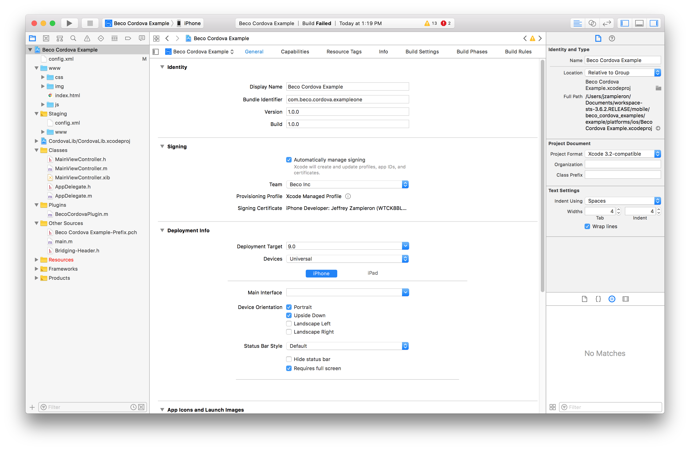

# Beco Cordova SDK Examples
Example apps for iOS and Android using the Beco Cordova SDK. 
Main SDK repository and User's Guide located at [https://github.com/becoinc/beco_cordova_sdk](https://github.com/becoinc/beco_cordova_sdk).

## Prereqs ##

Software you must have installed:

1. XCode 9 with command line tools.

2. Android Studio v3.0.1 or later.

3. npm (see [quick start](#quickstart)) and associated modules.

4. cordova (see [quick start](#quickstart))

##  Quick Start ##

1. Install [npm](https://www.npmjs.com/get-npm) or verify it is available on your machine. On macOS, we use
[Home Brew](https://brew.sh/) to install npm. We are using npm version `5.6.0` as part of node `9.5.0`.

2. Install [cordova](http://cordova.apache.org/) or verify that version `v8.0.0` is available on your system.
Cordova can be installed using `npm install -g cordova`.

3. Install [ios-deploy](https://github.com/phonegap/ios-deploy) using `npm install -g ios-deploy`.

4. Verify that `cordova` and `npm` are in your `PATH`.

5. Select one of the examples to work with: we include `example`, `kitchen` and `minimum`.

6. cd to the example folder and 
Install the [Beco Cordova SDK](https://github.com/becoinc/beco_cordova_sdk) into the selected example using: 
`cordova plugin add https://github.com/becoinc/beco_cordova_sdk.git#master`

7. Follow the [instructions](#instructions) below.

##  Instructions ##
The steps to run the examples included in this repository are as follows:

*1.* Insert your SDK Credentials into `www/js/index.js`, the root javascript file for the project you would like to run.

*2.* To retain a clean repository, we have not included preconfigured platform-specific project files. 
Add Android and/or iOS platforms by running `cordova platform add ios` and `cordova platform add android` 
in the root folder of the example you'd like to configure.

*3.* After cordova builds the platform projects, you must configure the projects by following the 
instructions in the [iOS Project Configuration](https://github.com/becoinc/beco_cordova_sdk#ios-project-configuration) 
and [Android Project Configuration](https://github.com/becoinc/beco_cordova_sdk#android-project-configuration) sections 
on the Cordova SDK's User Guide.

*4.* Open the platform-specific project for the platform you are testing on, and build/run the project on a device 
with bluetooth capabilities and a space with beacons configured. Refer to [Android](#android) or [iOS](#iOS)
sections as appropriate.

###  Android ###
This section covers building the actual Android app using Android Studio v2.3.3 once Cordova has generated the project.
Other Android specific developer details are covered as well.

The cordova examples use the Gradle build system with the relevant Android plugins pre-configured. Unfortunately,
they do not pre-configure the gradle wrapper scripts, so that setup is separate. Android Studio will offer
to do it for you on import.

#### Android Studio Project Setup/Use ####

These directions were tested using *Android Studio v3.0.1*.

You can import the generated project e.g. `example/platforms/android/` into Android Studio by pointing 
to the `build.gradle` file in that project folder.

The [Android Project Configuration](https://github.com/becoinc/beco_cordova_sdk#android-project-configuration) section
of the Beco Cordova SDK User's Guide discusses using the `cordova-plugin-android-permissions` cordova plugin
to obtain app permissions on Android. *This has already been done in the example apps.*

We also recommend allowing Android Studio to upgrade the example project. 

###  iOS ###

This section covers building the actual iOS app using XCode once Cordova has generated the project.
Other iOS specific details are covered as well.

Cordova generates _both_ an XCode workspace and project. This example and the Beco Cordova SDK were 
tested with XCode 9 and Swift 3.2.

#### XCode 9 Setup 

1. Open the project in XCode using `open platforms/ios/Beco\ Cordova\ Example.xcworkspace` if you have XCode
installed already.

2. Setup your signing profile and certificates in the `General` section of the project settings.
 

3. Configure the projects by following the instructions in the 
[iOS Project Configuration](https://github.com/becoinc/beco_cordova_sdk#ios-project-configuration) section.

4. After configuring the project you can do a command line build from by 
running the shell script: `./example/platforms/ios/cordova/build`.

5. Alternately, you can build within XCode.

## Main Example ##
The main example is in the `example` directory.
Once you build and run the example application on a phone and configure your Beco Beacons in your space, 
you should be able to walk around the space and view realtime location data. This example demonstrates error 
logging capabilities and uses all of the events that the SDK provides, and is intended as a starting point for 
building an application with the Beco Cordova SDK.

### Screenshots
 

## Minimal Example ##
A second example is in the `minimal` directory. This example demonstrates the bare minimum required to get location 
polling working with the Beco Cordova SDK. This example contains no error checking or logging.

### Screenshots

 

## Kitchen Example ##
The third example, in the `kitchen` directory, consists of a minimal program that will display a "Yes/No" text
based on whether the user is in a place with a `placeName` of `Kitchen`.

This demonstrates a simple (albeit contrived) usage of location data by checking the object data 
returned by the `onReceiveLocationData` event.

### Screenshots

 

## Appendix ##
### License

This document, the Beco Cordova SDK and the included sample application are subject to the Beco SDK license agreement. 
A copy of this agreement is available at https://www.beco.io/sdk-license-agreement.pdf, and has been 
included in this repository in `LICENSE.md`.

### Export Statement
You understand that the Software may contain cryptographic functions that may be subject to export restrictions, 
and you represent and warrant that you are not located in a country that is subject to United States export
restriction or embargo, including Cuba, Iran, North Korea, Sudan, Syria or the Crimea region, and that you are 
not on the Department of Commerce list of Denied Persons, Unverified Parties, or affiliated with a Restricted Entity.

You agree to comply with all export, re-export and import restrictions and regulations of the Department of 
Commerce or other agency or authority of the United States or other applicable countries. You also agree not 
to transfer, or authorize the transfer of, directly or indirectly, the Software to any prohibited country, 
including Cuba, Iran, North Korea, Sudan, Syria or the Crimea region, or to any person or organization on or 
affiliated with the Department of
Commerce lists of Denied Persons, Unverified Parties or Restricted Entities, or otherwise in violation of 
any such restrictions or regulations.
